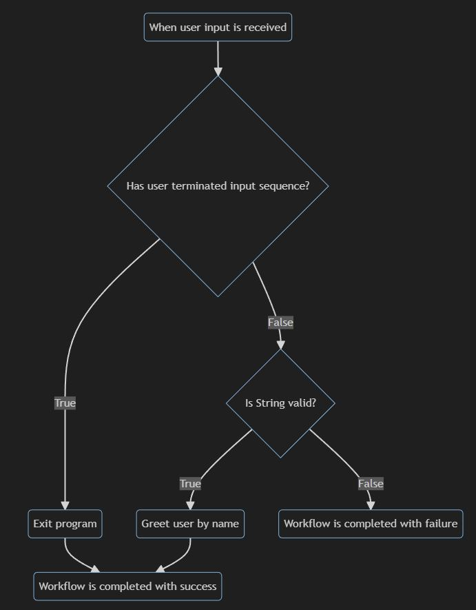

# ChainFlow
A Chain of Reponsibility centered library for Dotnet. 

## How does it work?
ChainFlow allows translating a flowchart in a code-equivalent version, and printing a markdown file (powered by Mermaid) to view an exact representation of the entire workflow so defined.

For example, given the following chart:

```

```

It can be traslated to a chain declaration:
```
chainBuilder
    .WithBooleanRouter<TerminateConsoleDispatcher>(
        (x) => x
            .With<TerminateConsoleFlow>()
            .Build(),
        (x) => x
            .With<DataValidatorFlow<string>>()
            .With<GreeterFlow>()
            .Build()
    )
    .Build();
```

Given that IHostBuilder has been initialized with the extension method:
```
var host = Host
        .CreateDefaultBuilder(args)
        .InitializeWorkflowHostBuilder(args) // this is needed to initialize ChainFlow
```

If the program is run with --doc argument flag, it will write a markdown file:

```


```

Adding the registrations of the flows with all their dependencies in DI will further refine the produced flowchart outcome:
```
::: mermaid
graph TD;
_start(When user input is received) -->
_-770479314{Has user terminated input sequence?}
_-319790253(Exit program)
_-2126499729{Is String valid?}
_-1681062939(Greet user by name)
Success(Workflow is completed with success)
Failure(Workflow is completed with failure)

_-770479314 --True--> _-319790253
_-770479314 --False--> _-2126499729
_-2126499729 --False--> Failure
_-2126499729 --True--> _-1681062939
_-319790253 --> Success
_-1681062939 --> Success
:::
```


Features:
 - chain of responsibility builder to ease definition of workflows
 - built-in self documenting program mode
 - conditional flow routers to express even more clearly workflow
 - extensible basic flows ready to use
 - simple dependency interfaces to be implemented
